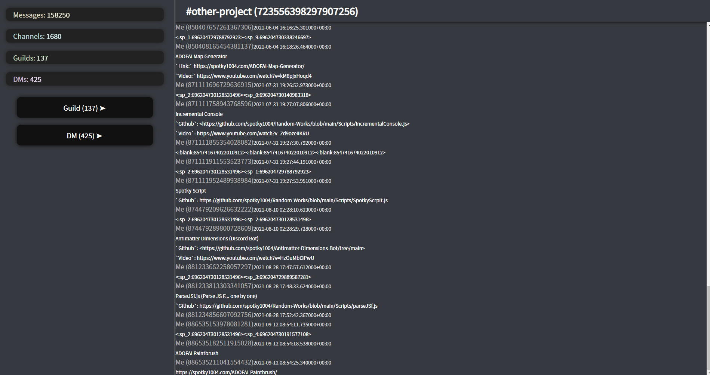
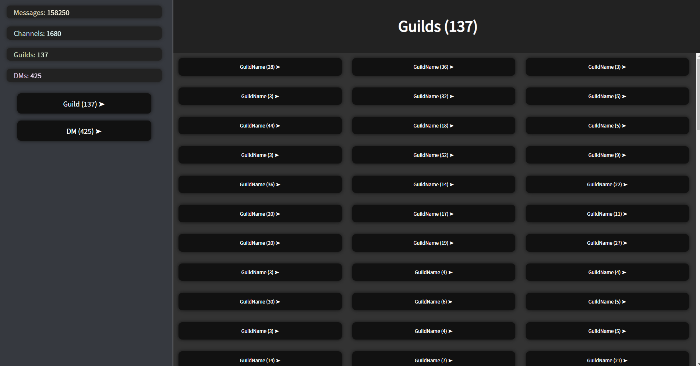

# Discord Package Viewer
=============
## How to use
1. Clone this repository to local (Code - Green button -> Download ZIP)
2. Move your discord package(the entire folder) to ./packages folder
3. Run start.cmd
## Screenshots

